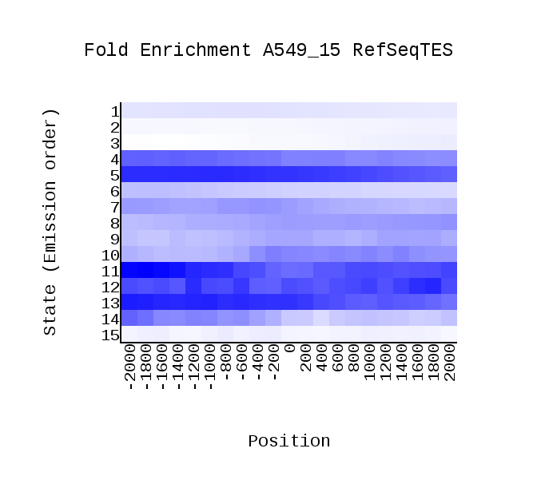
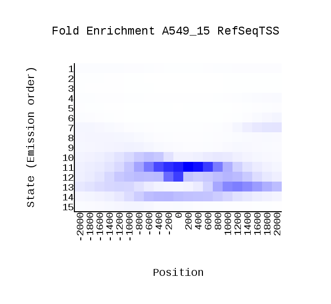
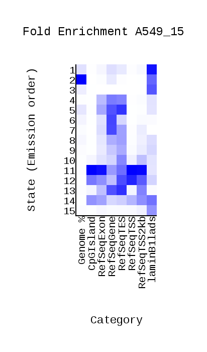
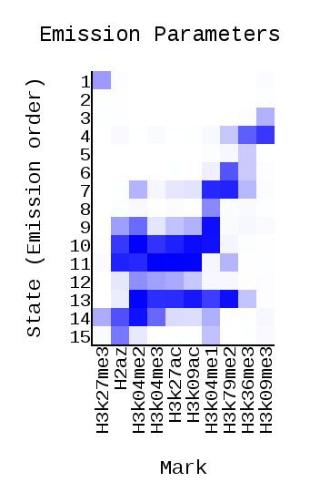
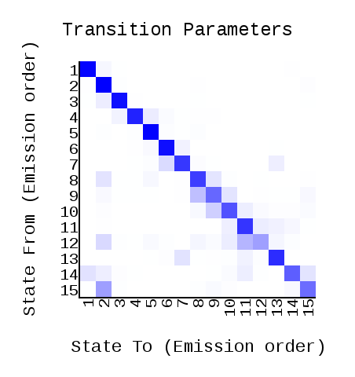
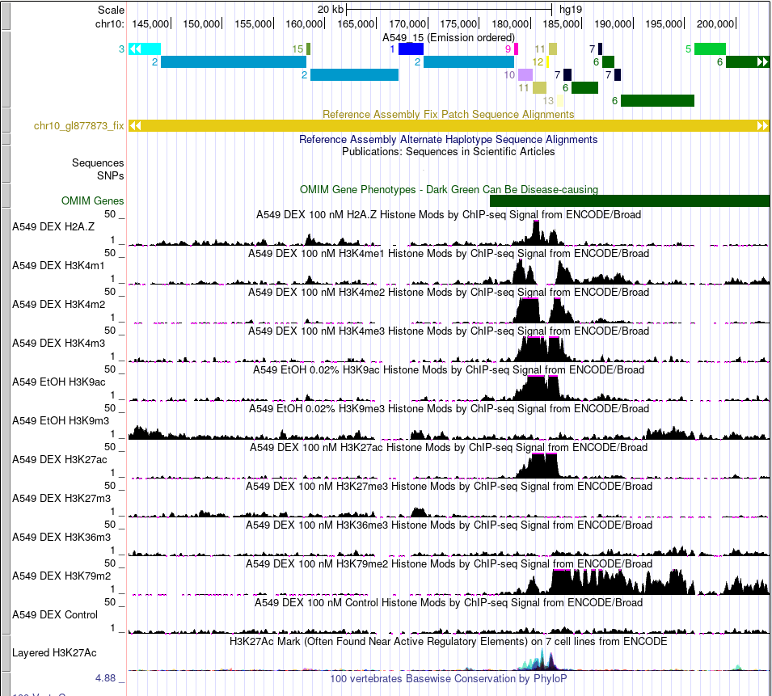
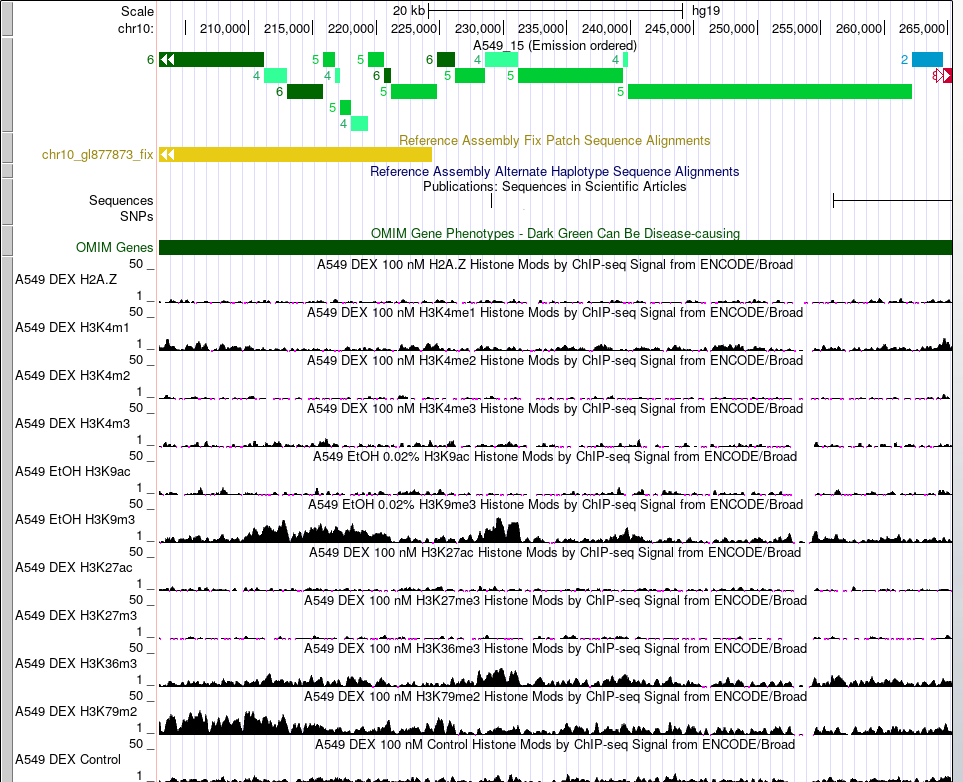

# hse_hw3_chromhmm

Клеточная линия - А549     
Контроль - wgEncodeBroadHistoneA549ControlDex100nmAlnRep1.bam      
[Работа c google colab](https://colab.research.google.com/drive/1eRLVGj3Y9n7jOmH9tADmuyT5izP1-XVU?usp=sharing)     

## Гистоновые Метки

Имя | Файл
--- | ---
H2az | wgEncodeBroadHistoneA549H2azDex100nmAlnRep1.bam
H3k27ac | wgEncodeBroadHistoneA549H3k27acDex100nmAlnRep1.bam
H3k27me3| wgEncodeBroadHistoneA549H3k27me3Dex100nmAlnRep1.bam
H3k36me3 | wgEncodeBroadHistoneA549H3k36me3Dex100nmAlnRep1.bam
H3k4me1 | wgEncodeBroadHistoneA549H3k04me1Dex100nmAlnRep1.bam
H3k4me2 | wgEncodeBroadHistoneA549H3k04me2Dex100nmAlnRep1.bam
H3k4me3 | wgEncodeBroadHistoneA549H3k04me3Dex100nmAlnRep1.bam
H3k79me2 | wgEncodeBroadHistoneA549H3k79me2Dex100nmAlnRep1.bam
H3k9ac | wgEncodeBroadHistoneA549H3k09acEtoh02AlnRep1.bam
H3k9me3 | wgEncodeBroadHistoneA549H3k09me3Etoh02AlnRep1.bam

## Файл cellmarkfiletable.txt

|   Клеточная линия   | Гистоновая метка | Файл метки*| Файл контроля*|
|:-------------------:|:----------------:|:----------:|:-------------:|
|A549	                |H2az	         |H2az.bam|Control.bam    |
|A549	                |H3k27ac	         |H3k27ac.bam	|Control.bam    |
|A549	                |H3k27me3	         |H3k27me3.bam|Control.bam    |
|A549	                |H3k36me3	         |H3k36me3.bam	|Control.bam    |
|A549	                |H3k4me1	         |H3k04me1.bam|Control.bam    |
|A549	                |H3k4me2	         |H3k04me2.bam	|Control.bam    |
|A549	                |H3k4me3	           |H3k04me3.bam	|Control.bam    |
|A549	                |H3k79me2	         |H3k79me2.bam	|Control.bam    |
|A549	                |H3k9ac	         |H3k09ac.bam|Control.bam    |
|A549	                |H3k9me3	             |H3k09me3.bam	  |Control.bam    |

## ChromHMM

## Табличка эпигенетических типов

|Название типа                         |Гистоновые метки |Типичное расположение |
|:------------------------------------:|:---------------:|:--------------------:|
|1 Active Promoter                     | H3k27me3 |Genome, RefSeqExon, RefSeqGene, RefSeqTES, RefSeqTSS2kb, laminB1lads|
|2 Weak Promoter                       | - |Genome, laminB1lads|
|3 Inactive/poised Promoter            | H3k9me3 |Genome, RefSeqExon, RefSeqGene, RefSeqTES, RefSeqTSS2kb, laminB1lads|
|4 Strong enhancer                     | H3k9me3 , H3k36me3, H3k79me2|RefSeqExon, RefSeqGene, RefSeqTES|
|5 Strong enhancer                     | H3k36me3|Genome, RefSeqExon, RefSeqGene, RefSeqTES, RefSeqTSS2kb|
|6 Weak/poised enhancer                | H3k36me3, H3k79me2|RefSeqExon, RefSeqGene, RefSeqTES, RefSeqTSS2kb|
|7 Weak/poised enhancer                | H3k4me1, H3k4me2, H3k36me3, H3k79me2|RefSeqExon, RefSeqGene, RefSeqTES, RefSeqTSS2kb, laminB1lads|
|8 Insulator                           | H3k4me1|RefSeqExon, RefSeqGene, RefSeqTES, RefSeqTSS, RefSeqTSS2kb, laminB1lads|
|9 Transcriptional transition          | H2az, H3k4me1, H3k4me2, H3k4me3, H3k27ac, H3k9ac|Genome, RefSeqExon, RefSeqTES, RefSeqTSS2kb, laminB1lads|
|10 Transcriptional elongation         | H2az, H3k4me2, H3k4me3, H3k9ac, H3k27ac, H3k4me1|CpGIsland, RefSeqExon, RefSeqGene, RefSeqTES, RefSeqTSS, RefSeqTSS2kb, laminB1lads|
|11 Weak transcribed                   | H2az, H3k4me2, H3k4me3, H3k9ac, H3k27ac, H3k79me2|CpGIsland, RefSeqExon, RefSeqGene, RefSeqTES, RefSeqTSS, RefSeqTSS2kb, laminB1lads|
|12 Polycomb-repressed                 | H3k4me2, H3k4me3, H3k9ac, H3k27ac|CpGIsland, RefSeqExon, RefSeqGene, RefSeqTES, RefSeqTSS, RefSeqTSS2kb|

# UCSC Genome Browser

